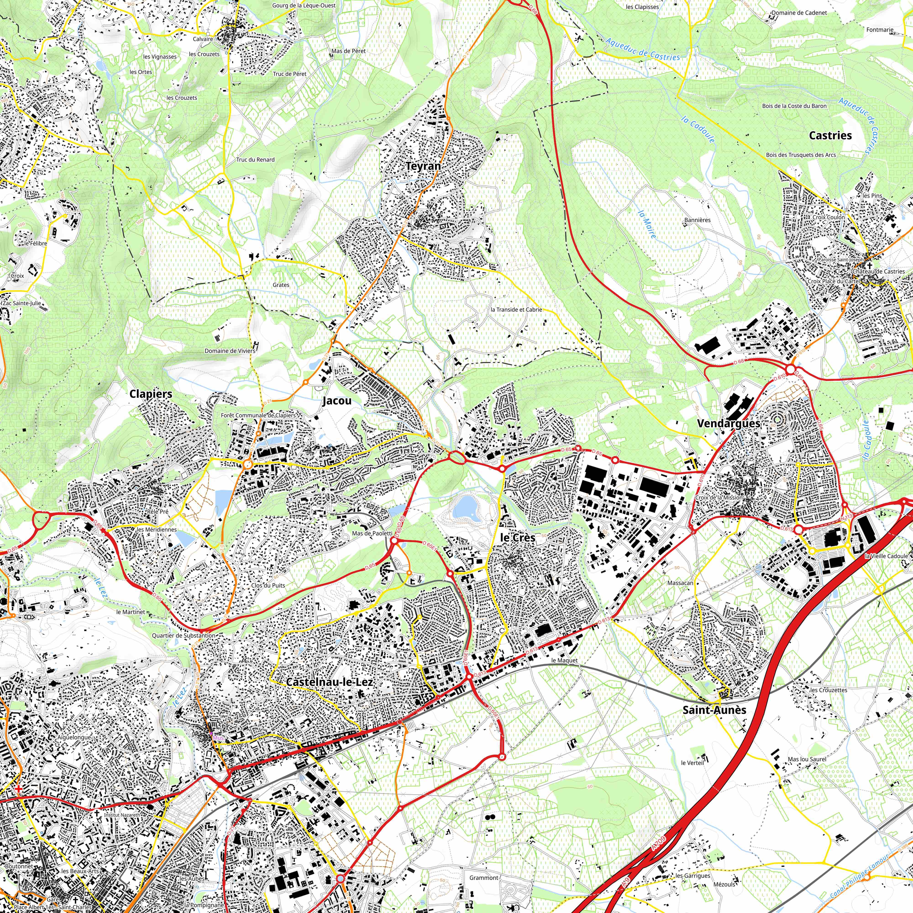

# **osm2igeotopo**

**[Télécharger les données générées sur la France métropolitaine, les DOM-TOM](https://data.data-wax.com/?dir=OSM2IGEOTOPO25/FRANCE/)** ([Découpage suivant les anciennes régions](https://fr.wikipedia.org/wiki/Région_française)).

---
## Objectif du projet

Utiliser la richesse des informations disponibles dans [OpenStreetMap](https://www.openstreetmap.fr) et les valoriser sous la forme d'une carte topographique libre au 1/25 000 (pseudo [SCAN25® | IGN](https://professionnels.ign.fr/scan25)) afin qu'elles puissent être librement exploitées dans une application SIG ou plus simplement imprimées.

## Rendu proposé

## Pourquoi cette idée ?

Après la création  du projet [OSM2IGEO](https://github.com/igeofr/osm2igeo), j'ai constaté qu'il n'existait pas de carte topographique "libre" ormis le projet Web : [OpenTopoMap](https://opentopomap.org) mais qui ne répond pas à certains besoins de portabilité.

En m'appuyant sur les données générées pour [OSM2IGEO](https://github.com/igeofr/osm2igeo), j'ai donc poursuivi mes travaux pour produire une chaine de traitement permettant de générer et de communiquer des données topographiques sous forme de tuiles de 10*10km.

## Les données générées
**[Télécharger les données générées sur la France métropolitaine, les DOM-TOM](https://data.data-wax.com/?dir=OSM2IGEOTOPO25/)** ([Découpage suivant les anciennes régions](https://fr.wikipedia.org/wiki/Région_française)).
A plus long terme, nous aimerions générer des cartes topographiques sur l'Afrique Francophone ou ce type de carte est difficilement accessible.

**Attention :** Les fichiers générés ne respectent pas les spécifications du [SCAN25® | IGN](https://professionnels.ign.fr/scan25) ils visent seulement à s'en rapprocher pour pallier à un besoin de données/informations libres.

## Origine des données

1. Les données OpenStreetMap utilisées pour générer les fichiers vectoriels régionaux proviennent de [Geofabrik](https://download.geofabrik.de/europe/france.html) et sont ensuite mis en formes dans le cadre du projet [OSM2IGEO](https://github.com/igeofr/osm2igeo).

2. Le modèle numérique utilisé provient du projet européen EU-DEM (V1.1) disponible via le site internet de [Copernicus](https://land.copernicus.eu/imagery-in-situ/eu-dem/eu-dem-v1.1) - Nota : inscription obligatoire. La résolution de  ce produit est de 25 mètres.

*Il est possible d'adapter ce projet pour utiliser des données OSM provenant d'autres sources.*

## Les points forts

  * Adaptabilité de la chaîne
  * Donnée ouverte basée sur le projet collaboratif [OpenStreetMap](https://www.openstreetmap.fr)
  * Couverture régionale
  * Mise à jour en continu possible

## Les points faibles

  * Hétérogénéité spatiale & attributaire (Hétérogénéités des sources et des compétences des contributeurs).
  * Rendu à améliorer sur certains points.

## Formats

* .tif

*Il est possible d'envisager d'autres formats si le besoin se fait sentir.*

## Projections disponibles

* Pour la France métropole : (RGF 93) projection Lambert-93 (EPSG : 2154)

*Il est possible de générer les fichiers dans d'autres systèmes de projection.*

## Mises à jour
Nous allons essayer de proposer une mise à jour chaque mois.

## Pré-requis et étapes de la chaine de traitement osm2igeotopo

#### Pré-requis

Télécharger la police d'écriture  [Noto Sans Display Condensed](https://www.google.com/get/noto/) - *Proposée par Romain Lacroix dans son tuto : [Carte Topo avec QGIS](https://github.com/rxlacroix/CarteTopo)*

**A creuser :** [Typography for topography : BELLTOPO SANS TYPEFACE & FREE FONT](https://www.sarahbellmaps.com/typography-for-topography-belltopo-sans-free-font/)

#### Des données à la carte - Etapes

##### 1. Téléchargement des données
1.1.  Télécharger le modèle numérique de terrain EU-DEM (V1.1) disponible via le site internet de [Copernicus](https://land.copernicus.eu/imagery-in-situ/eu-dem/eu-dem-v1.1) - Nota : inscription obligatoire.

* Pour la France métropolitaine télécharger les tuiles : E30N20 (principale), E30N30, E40N20  (un fichier pouvant peser jusqu'à 5Go)  - Système de projection européen ETRS89 (EPSG:3035).

* Créer un raster virtuel regroupant les différentes tuiles EU-DEM :

      cd "/OSM2IGEOTOPO/"
      gdalbuildvrt data_in/dsm/1_VRT.vrt  data_in/dsm/*.tif

1.2. Télécharger les zones maritimes depuis le site : [https://osmdata.openstreetmap.de](https://osmdata.openstreetmap.de)

    cd "/OSM2IGEOTOPO/"
    curl --limit-rate 100K https://osmdata.openstreetmap.de/download/water-polygons-split-4326.zip > "data_in/oceans_seas/water-polygons-split-4326.*"

___

##### 2. Des données à la carte : Préparation et traitement des données :
*Le script 2_osm2igeotopo25.sh exploite la puissance de gdal et d'ogr2ogr pour traiter l'information.*

**Exécuter cette commande pour lancer la production des tuiles.**

    cd "/OSM2IGEOTOPO/"
    2_osm2igeotopo25.sh 11_ILE_DE_FRANCE

**Etapes du script**
  - 2.1. Téléchargement et décompression des données [OSM2IGEO](https://data.data-wax.com/OSM2IGEO/)
  - 2.2. Création d'une zone tampon de 500m autour des communes de la région concernée
  - 2.3. Découpage du modèle numérique sur la région concernée
  - 2.4. Création des courbes de niveau
  - 2.5. Création d'un fichier de l'emprise régionale
  - 2.6. Découpage des courbes de niveau suivant  ce fichier d'emprise régionale
  - 2.7. Sélection des mailles recouvrant la région choisie
  - 2.8. Sélection des zones maritimes bordant la région
  - 2.9. Création de raster d'ombrage à partir des données EU-DEM
  - 2.9. Export de la carte sous forme de tuiles : L'export est automatisé par un script python qui s'appuye sur l'API de QGIS (export_atlas.py)

**Attention :**
  - il faut modifier les chemins en fonction de votre organisation (home/...)
  - il faut modifier la fin du script si vous souhaitez exporter ou non le résultat sur un serveur FTP (Curl).

___

##### 3. Mise en forme des données
Pour faciliter la mise en forme des données nous avons travaillé avec le logiciel libre [QGIS3](https://www.qgis.org).

  - 3.1. La mise en forme des labels se base sur [notre script de mise en forme des toponymes suivant les règles de l'IGN](https://github.com/igeofr/qgis2/blob/master/expressions/mise_en_forme_des_toponymes_V2_beta.txt)

###### Pour aller plus loin :
> [Commission de toponymie du Québec - Toponyme et abbréviation](http://www.toponymie.gouv.qc.ca/ct/normes-procedures/terminologie-geographique/liste-termes-geographiques.aspx)

  - 3.2. L'orientation des labels est réalisée à l'aide du code :

        CASE
          WHEN angle_at_vertex($geometry,1) <= 180
          THEN ''
            ELSE "NUMERO"
        END

Source : https://gis.stackexchange.com/questions/116697/one-label-for-two-lane-roads-osm-qgis-postgis/322816#322816

  - 3.3. La mise en forme des labels des courbes de niveau. [A creuser](https://pigrecoinfinito.com/2020/01/31/qgis-come-allineare-le-etichette-delle-isoipse/) - [A creuser avec QGIS3.12](https://twitter.com/underdarkgis/status/1235641033381171200) - [A creuser avec QGIS3.12](https://twitter.com/klaskarlsson/status/1247145131234525184)
  - 3.4. La symbologie a été adapté du projet de Romain Lacroix : [Carte Topo avec QGIS](https://github.com/rxlacroix/CarteTopo)
  - ~~3.5. Améliorer le rendu du MNT : [Corriger l'effet de grille](https://mobile.twitter.com/antoniolocandro/status/1232349539295748099) - [Le problème] (https://gis.stackexchange.com/questions/271439/hillshade-shows-grid-texture-artifacts)~~
  - ~~3.6. Effets ade profondeur pour les plans d'eau [Ajouter un effet](https://twitter.com/timlinux/status/1255463780412198912)~~

##### 5. Compression des tuiles

###### A suivre :
* [Benchmarks - Lossless compression algorithms](https://www.gaia-gis.it/fossil/librasterlite2/wiki?name=benchmarks+%282019+update%29)
* [Guide to GeoTIFF compression and optimization with GDAL](https://kokoalberti.com/articles/geotiff-compression-optimization-guide/)

___

## Pistes d'évolution
* ~~Compléter nos travaux OSM2IGEO pour compléter le rendu (bornes géodésiques, points de vue, surfaces en eau,...)~~
* Créer une légende [Légende OpenTopoMap](https://opentopomap.org/about)
* Créer un fichier de métadonnées
* ~~Affiner certaines requêtes~~
* Améliorer le rendu du projet QGIS (couleurs, labels, orientation des symboles ...)
* Améliorer la  recette pour le rendu du modèle numérique et le calcul des courbes de niveau ([Des cartes topographiques avec OpenStreetMap](https://blog.champs-libres.coop/carto/2018/12/18/openardennemap.html))
* Ajouter des courbes de niveau en zone maritime : [GEBCO_2019 grid](https://www.gebco.net/data_and_products/gridded_bathymetry_data/#a1)

## Licence
Les données sont fournies sous licence ODbL (Open Database Licence). Cette licence implique : l'attribution et le partage à l'identique.

*	Pour la mention d'attribution veuillez indiquer « osm2igeotopo par DATA\WAX - © les contributeurs d’OpenStreetMap - Copernicus programme, European Digital Elevation Model (EU-DEM), version 1.1, financement de l'Union européenne ».
*	Pour le partage à l'identique, toute amélioration des données de osm2igeotopo doit être repartagée sous licence identique.

## Merci
Nous remercions tous les contributeurs du  projet OpenStreetMap qui enrichissent quotidiennement cette base de données géographique mondiale.

## Le mot de la fin
Merci de nous faire remonter : les erreurs et/ou les problèmes que vous rencontrez.

Pour toute question concernant le projet ou le jeu de données, vous pouvez me contacter : florian.boret)at(data-wax.com

---
## Pour aller plus loin :
* [Carte Topo avec QGIS](https://github.com/rxlacroix/CarteTopo)  
* [Des cartes topographiques avec OpenStreetMap](https://blog.champs-libres.coop/carto/2018/12/18/openardennemap.html)
* [De belles courbes de niveau](https://www.champs-libres.coop/blog/post/2019-11-21-beautiful-contour-belgium/)
* [OpenArdenneMap – version hiver 2019-2020](http://www.nobohan.be/2020/02/05/openardennemap-livraison-hiver-2019-2020/)
* [OpenTopoMap](https://opentopomap.org)
* [Réaliser un fond de carte en relief](http://bota-phytoso-flo.blogspot.com/2015/08/realiser-un-fond-de-carte-en-relief.html)
* [Comment lire une carte topographique - Partie1](https://blog.twonav.fr/tutoriels-land/lire-carte-topographique-2eme-partie/)
* [Comment lire une carte topographique - Partie2](https://blog.twonav.fr/uncategorized/comment-lire-carte-topographique/)
* [RandoCarto](http://randocarto.fr)
* [A creuser : Rendu DSM / Littoral](https://xycarto.com/blog/)

---
## Biblio :
* [How Do Map Readers Recognize a Topographic Mapping Style?](https://www.researchgate.net/publication/284898837_How_Do_Map_Readers_Recognize_a_Topographic_Mapping_Style)
* [How to design a cartographic continuum to help users to navigate between two topographic styles?](https://www.researchgate.net/publication/318466208_How_to_design_a_cartographic_continuum_to_help_users_to_navigate_between_two_topographic_styles)

---
## Sur le sujet :
* [Alternative au Scan25 & rendus OSM](https://georezo.net/forum/viewtopic.php?id=105965)
* [Equivalent IGN et Geoportail en Côte d'Ivoire](https://georezo.net/forum/viewtopic.php?pid=328198)
